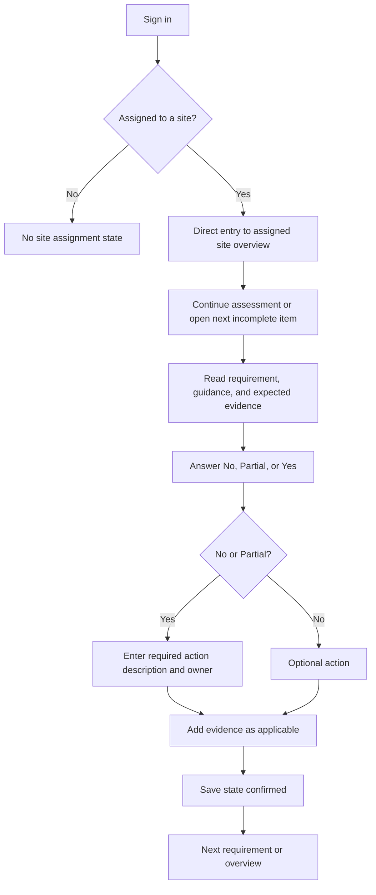
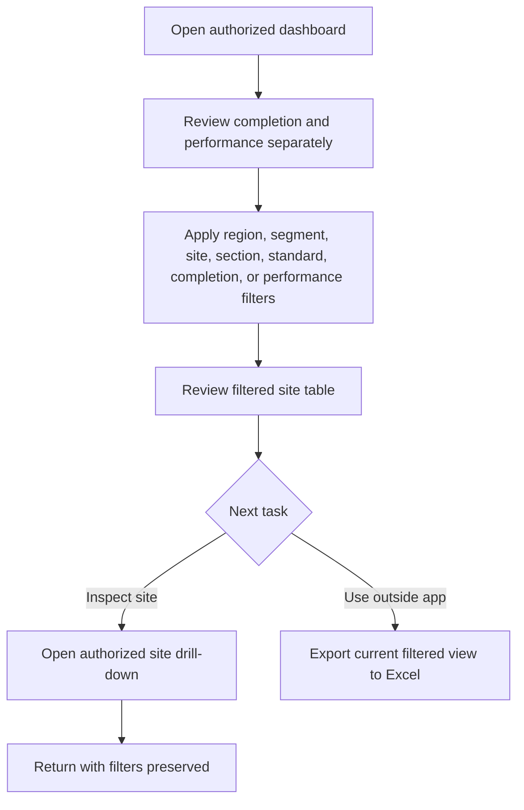
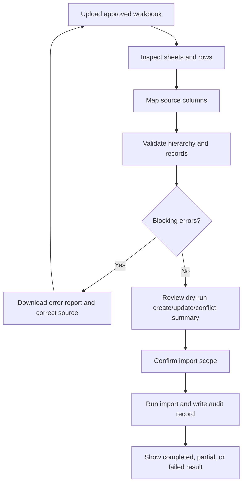

# KC EHS&S Design System

**Version:** 0.1  
**Status:** Pre-development baseline  
**Last updated:** 14 August 2026  
**Product:** Kimberly-Clark EHS&S Self-Assessment Platform — Phase 1  
**Owners:** Product Design, Product, Engineering, Accessibility, KC Brand  

---

## 1. Purpose

This document is the design source of truth for the Phase 1 EHS&S web application. It defines the visual foundations, interaction rules, reusable components, domain-specific patterns, responsive behavior, accessibility requirements, and screen recipes needed to design and build the product end to end.

The intended experience is a calm, precise, modern enterprise application:

- Apple Human Interface Guidelines influence clarity, familiarity, feedback, adaptability, accessibility, restraint, and craft.
- Google Sans Flex / Google Sans provides the product typography.
- Kimberly-Clark blue provides the brand theme.
- Dense assessment work remains readable and efficient; the interface must never become decorative at the expense of safety-critical information.
- Design decisions must keep **completion** and **performance** as separate concepts.

This is a web design system. It applies Apple principles without copying iOS chrome or presenting a Windows/Chrome web application as a native Apple application.

---

## 2. Locked product decisions reflected here

These rules override contradictory wording in older drafts.

1. **Single-site entry for site users.** There is no multiple-site selection state and no site switcher for a site contributor. The assigned site is visible as non-interactive context on every editable page.
2. **Primary and Backup Owners have equal edit permissions** for their assigned site.
3. Site users can edit assessment responses, evidence, actions, site contacts, and owner records only within their authorized scope.
4. Requirement text, “How to meet the requirement,” and “Evidence requirements” are read-only master content for non-admin users.
5. Each question has exactly one response: **No**, **Partial**, or **Yes**.
6. Response mapping is No → Initial, Partial → Emerging, Yes → Performing.
7. A requirement’s result is the lowest result among its underlying questions.
8. **Both No and Partial require an action description and owner.** Yes may have an optional action.
9. Evidence supports multiple visible items per requirement, while file types, limits, retention, and malware-scanning policy remain to be confirmed.
10. Phase 1 supports Initial, Emerging, and Performing only. Optimized, World-Class, and Select are not selectable or displayed as reachable levels.
11. Environmental assessment standards are excluded from Phase 1 assessment navigation and scoring.
12. Dashboard completion and performance must be shown as distinct measures.
13. Validation Mode, ISO Readiness Mode, action due dates/workflow, automated reminders, top-three gaps, localization, native mobile/offline, and mandatory Power BI are outside Phase 1.

### 2.1 Decisions the design must keep flexible

- Continuous living record versus formal assessment cycles/submission.
- N/A and applicability rules.
- Final section, standard, and overall roll-up formula.
- Regional edit versus read-only permissions.
- Evidence file policy.
- Identity provider and hosting model.
- Scale and performance targets.

Until these are resolved, components must expose configuration rather than hard-code an irreversible behavior. In particular, do not place a final **Submit assessment** action in production designs unless the lifecycle decision is approved.

---

## 3. Design principles

### 3.1 Purpose first

The current task, site, requirement, completion state, and next action should be immediately clear. Put the most important assessment content before secondary metadata.

### 3.2 Simple and direct

Remove controls that do not help the current task. Use progressive disclosure for long guidance, evidence requirements, audit details, and advanced filters.

### 3.3 Familiar and consistent

The same component must have the same meaning everywhere. Buttons perform actions; links navigate; blue interactive text is not used as decoration. Familiar browser and keyboard behavior is preserved.

### 3.4 Context is never lost

Keep the assigned site, section, subsection, requirement, permission mode, and save state visible. Moving between questions must preserve entered work and return focus predictably.

### 3.5 Clear feedback and recovery

Every important action shows its state: saving, saved, failed, uploading, exported, restricted, or incomplete. Avoid silent failure. Preserve recoverable user input after validation or network errors.

### 3.6 Flexible by default

Layouts adapt across desktop, tablet, small screens, zoom, text enlargement, keyboard, mouse, and touch. Compact views recompose content; they do not shrink a desktop canvas.

### 3.7 Responsible handling of data

Explain why evidence, owner details, and permissions are needed. Never expose files or site data outside authorization scope. Destructive actions require clear confirmation and, where feasible, recovery.

### 3.8 Restrained craft

Use precise spacing, typography, alignment, and short purposeful motion. Brand expression comes from color, typography, and quality—not heavy gradients, visual noise, or excessive glass effects.

---

## 4. Brand direction

### 4.1 Working KC blue

Use `#3C93CB` as the working digital Kimberly-Clark blue seed. This value must be confirmed against KC’s internal current brand standards before production sign-off. If KC provides an official digital token, replace the seed and regenerate the scale while preserving the semantic token names.

The brand seed does **not** have sufficient contrast with white for normal-sized text. Therefore:

- KC Blue 500 is for brand accents, illustrations, progress fills, selected surfaces with dark text, and large non-text areas.
- KC Blue 600 or darker is used for primary filled buttons with white text.
- KC Blue 700 is used for links on white.
- Status meanings use semantic colors, not KC blue.

### 4.2 Brand tone

- Trustworthy, human, practical, and precise.
- Clean white and cool-neutral surfaces.
- Brand blue is concentrated in navigation, primary actions, focus, and key progress.
- No ornamental safety imagery behind assessment text.
- No glossy 3D treatment on core controls.

### 4.3 Logo handling

- Use only an approved KC logo asset supplied by the client.
- Preserve clear space and aspect ratio.
- Do not recolor, recreate, typeset, animate, or place the logo inside a generic circular avatar.
- The product name may sit adjacent to the logo: **EHS&S Self-Assessment**.
- The app must remain identifiable when the navigation rail is collapsed.

---

## 5. Color system

### 5.1 Brand scale

| Token | Value | Intended use |
|---|---:|---|
| `kc-blue-50` | `#F2F9FD` | Subtle selected backgrounds |
| `kc-blue-100` | `#E4F3FA` | Information and progress backgrounds |
| `kc-blue-200` | `#C5E5F4` | Selected borders, chart fills |
| `kc-blue-300` | `#98D0E8` | Decorative data fills |
| `kc-blue-400` | `#68B5DB` | Hover accents, secondary chart series |
| `kc-blue-500` | `#3C93CB` | Working KC brand seed; 3.37:1 with white |
| `kc-blue-600` | `#2178B2` | Primary action; 4.78:1 with white |
| `kc-blue-700` | `#17689F` | Link/action text on white; 5.97:1 |
| `kc-blue-800` | `#165E8E` | Pressed action, dark emphasis |
| `kc-blue-900` | `#164E73` | Dark brand surface |
| `kc-blue-950` | `#0C2A3E` | Deep navigation or dark-theme surface |

Contrast values above use WCAG relative-luminance calculation and must be rechecked if colors change.

### 5.2 Neutral scale

| Token | Value | Intended use |
|---|---:|---|
| `neutral-0` | `#FFFFFF` | Primary surface |
| `neutral-25` | `#FCFCFD` | Page background alternative |
| `neutral-50` | `#F8FAFC` | Page background |
| `neutral-100` | `#F1F5F9` | Subtle surface |
| `neutral-200` | `#E2E8F0` | Default border |
| `neutral-300` | `#CBD5E1` | Strong border, disabled border |
| `neutral-400` | `#94A3B8` | Placeholder, disabled icon |
| `neutral-500` | `#64748B` | Secondary text |
| `neutral-600` | `#475569` | Supporting text |
| `neutral-700` | `#334155` | Strong supporting text |
| `neutral-800` | `#1E293B` | Primary text alternative |
| `neutral-900` | `#0F172A` | Primary text |
| `neutral-950` | `#020617` | High-emphasis dark surface |

### 5.3 Semantic colors

| Meaning | Strong | Surface | Border | Text/icon rule |
|---|---:|---:|---:|---|
| Success / Performing / Yes | `#067647` | `#ECFDF3` | `#ABEFC6` | Use check icon + label |
| Warning / Emerging / Partial | `#B54708` | `#FFFAEB` | `#FEDF89` | Use half-circle icon + label |
| Danger / Initial / No | `#B42318` | `#FEF3F2` | `#FECDCA` | Use x/octagon icon + label |
| Information | `#17689F` | `#F2F9FD` | `#C5E5F4` | Use info icon + label |
| Provisional | `#6941C6` | `#F9F5FF` | `#D6BBFB` | Use flask/draft icon + label |
| Neutral / Not assessed | `#475569` | `#F8FAFC` | `#CBD5E1` | Use empty-circle icon + label |

### 5.4 Completion colors are independent

| Completion state | Visual treatment |
|---|---|
| Not started | Neutral badge + `0%` |
| In progress | KC Blue badge/progress + exact percentage |
| Complete | Success badge + `100%` |
| Incomplete due to required action | Warning surface + issue count |
| Save failed | Danger inline message; do not change performance color |

### 5.5 Color rules

- Never communicate status with color alone. Pair color with text, icon, pattern, or position.
- Red is reserved for errors, destructive actions, No/Initial, and critical gaps.
- Green is reserved for success, Yes/Performing, and complete states.
- Amber indicates Partial/Emerging or caution, not generic decoration.
- Brand blue indicates interaction, selection, information, or neutral progress—not compliance success.
- Charts include direct labels or accessible legends and a tabular alternative.
- Light and dark color themes must use semantic tokens; components may not hard-code palette values.

---

## 6. Typography

### 6.1 Font family

Primary stack:

```css
font-family: "Google Sans Flex", "Google Sans",  system-ui, sans-serif;
```

Implementation guidance:

- Prefer **Google Sans Flex** as the variable web font and Google Sans as a static fallback.
- Use only Regular, Medium, Semibold, and Bold-equivalent weights in product UI.
- Self-host approved WOFF2 files in the corporate application where privacy, reliability, or Content Security Policy favors self-hosting.
- Use `font-display: swap` and preload only the core variable font.
- Do not use Product Sans.
- Keep system fallbacks so the interface remains usable before or without font load.
- Enable tabular numerals for completion percentages, timestamps, counts, and metrics.

Example:

```css
@font-face {
  font-family: "Google Sans Flex";
  src: url("/fonts/google-sans-flex.woff2") format("woff2-variations");
  font-style: normal;
  font-weight: 100 1000;
  font-display: swap;
}
```

### 6.2 Type scale

| Token | Size / line height | Weight | Use |
|---|---|---:|---|
| `display-sm` | 36 / 44 px | 650–700 | Rare landing/empty-state headline |
| `heading-1` | 32 / 40 px | 650–700 | Page title |
| `heading-2` | 24 / 32 px | 600–650 | Major section title |
| `heading-3` | 20 / 28 px | 600 | Card/requirement title |
| `title` | 18 / 26 px | 600 | Panel title |
| `body-lg` | 18 / 28 px | 400 | Important guidance/intro |
| `body` | 16 / 24 px | 400 | Default content and form values |
| `body-sm` | 14 / 20 px | 400 | Tables and supporting content |
| `label` | 14 / 20 px | 500–600 | Field labels and controls |
| `caption` | 12 / 16 px | 500 | Metadata only; never core instructions |
| `metric` | 32 / 36 px | 650 | Completion/performance KPI |

### 6.3 Typography rules

- Default body text is 16 px. Dense tables may use 14 px but never smaller for essential content.
- Long requirement and guidance text has a readable measure of 65–85 characters.
- Avoid Light and Thin weights.
- Use sentence case for buttons, labels, tabs, and headings.
- Avoid all caps except short established abbreviations such as EHS&S, ISO, and KC.
- Do not truncate requirement text. Truncation is allowed only for secondary table cells with a clear way to view the full value.
- Support browser zoom to 400% and text spacing overrides without loss of content or operation.

---

## 7. Spacing, sizing, and layout

### 7.1 Spacing scale

Use a 4 px base unit.

| Token | Value |
|---|---:|
| `space-0` | 0 |
| `space-1` | 4 px |
| `space-2` | 8 px |
| `space-3` | 12 px |
| `space-4` | 16 px |
| `space-5` | 20 px |
| `space-6` | 24 px |
| `space-8` | 32 px |
| `space-10` | 40 px |
| `space-12` | 48 px |
| `space-16` | 64 px |
| `space-20` | 80 px |

Component spacing uses 8, 12, 16, or 24 px in most cases. Page-section spacing uses 32–64 px.

### 7.2 Control sizes

| Size | Visual height | Minimum hit area | Use |
|---|---:|---:|---|
| Compact | 32 px | 36 × 36 px | Dense desktop tables only |
| Default | 40 px | 44 × 44 px | Standard desktop/tablet controls |
| Large | 48 px | 48 × 48 px | Primary mobile actions and important forms |

Frequently used touch controls target at least 44 × 44 CSS px. Any compact visual control must have sufficient invisible hit area or spacing.

### 7.3 Grid and containers

- Global maximum application width: 1600 px.
- Standard content maximum: 1280 px.
- Requirement workspace maximum: 1440 px.
- Form reading width: 760 px.
- Long-form guidance measure: 720 px or 65–85 characters.
- Desktop page gutter: 32 px; wide: 40 px; tablet: 24 px; mobile: 16 px.
- Use CSS Grid for page composition and Flexbox for local alignment.
- Use container queries for reusable cards and panels where supported.

### 7.4 Breakpoints

| Mode | Width | Behavior |
|---|---:|---|
| Compact | 320–767 px | One column, navigation drawer, stacked controls, sticky bottom task actions |
| Medium | 768–1199 px | Collapsible rail, one/two-column content, guidance in sheet |
| Large | 1200–1599 px | Persistent side navigation, two/three-column workspaces |
| Wide | 1600 px+ | Centered max-width layouts; never stretch readable text indefinitely |

Breakpoints are behavior thresholds, not device names.

### 7.5 Requirement workspace layout

- Large: assessment navigator 280 px / main response area minmax(560 px, 1fr) / guidance panel 320–360 px.
- Medium: collapsible navigator + main area; guidance opens as a side sheet.
- Compact: single column; navigator opens as a full-height drawer; requirement/guidance/evidence use disclosures; previous/next actions are sticky at the bottom.
- Do not reduce the entire desktop workspace scale on mobile.

---

## 8. Shape, borders, elevation, and material

### 8.1 Radius

| Token | Value | Use |
|---|---:|---|
| `radius-sm` | 6 px | Small tags, compact controls |
| `radius-md` | 10 px | Inputs and buttons |
| `radius-lg` | 14 px | Cards and panels |
| `radius-xl` | 18 px | Dialogs, sheets, prominent containers |
| `radius-pill` | 999 px | Badges and segmented selections only |

### 8.2 Borders

- Default border: 1 px `neutral-200`.
- Strong/selected border: 1 px `kc-blue-600`.
- Error border: 1–2 px danger strong.
- Dividers separate related content; avoid boxing every element.

### 8.3 Elevation

| Token | Use |
|---|---|
| `shadow-0` | Flat content |
| `shadow-1` | Cards and sticky toolbars |
| `shadow-2` | Popovers and dropdowns |
| `shadow-3` | Dialogs and sheets |

Shadows are soft and low contrast. Elevation communicates layering, not decoration.

### 8.4 Apple-inspired material usage

Translucent/glass material may be used on the persistent app bar or a floating task toolbar only. Use 84–92% surface opacity, restrained blur, a clear border, and a solid fallback when transparency is reduced or unsupported. Do not place dense assessment text, forms, tables, alerts, or evidence metadata on glass.

---

## 9. Icons and imagery

- Use one neutral SVG icon family with consistent 1.75–2 px strokes.
- Default icon sizes: 16, 20, and 24 px; 32 px for empty states.
- Always provide accessible names for icon-only controls.
- Decorative icons are hidden from assistive technology.
- Use filled status shapes sparingly; regular interface icons remain outline-based.
- Do not use emoji as functional icons.
- Do not use SF Symbols in the cross-platform web build unless licensing and target-platform use are explicitly approved.
- Product imagery is optional. Assessment workspaces favor content and data over decorative illustrations.
- Empty-state illustrations, if used, must be simple, low-contrast, and never convey required information alone.

---

## 10. Motion and feedback

### 10.1 Timing

| Token | Duration | Use |
|---|---:|---|
| `motion-instant` | 0–80 ms | Press feedback |
| `motion-fast` | 120 ms | Hover/focus color transition |
| `motion-standard` | 180 ms | Disclosure, tab, validation feedback |
| `motion-emphasized` | 240 ms | Dialog/sheet entry |
| `motion-exit` | 160 ms | Overlay exit |

Use standard ease-out for entry and ease-in for exit. Avoid spring/bounce motion in routine assessment tasks.

### 10.2 Rules

- Motion explains relationship, change, or feedback; it is never required to understand status.
- Inputs respond immediately.
- Do not block interaction until an animation completes.
- Respect `prefers-reduced-motion: reduce`; replace transforms with brief opacity changes or no transition.
- Skeletons do not shimmer indefinitely under reduced motion.
- Save and upload states use text plus icon, with polite live-region announcements.

---

## 11. Accessibility baseline

Target **WCAG 2.2 Level AA** for the complete web product.

### 11.1 Required behavior

- All functions work with keyboard alone.
- Focus order follows the visual/task order.
- Focus is visible, not clipped, and not hidden under sticky headers or footers.
- Default focus ring: 2 px KC Blue 600 with 2 px white/surface offset; use a dark ring on blue surfaces.
- Text contrast is at least 4.5:1; large text and essential non-text controls meet applicable WCAG contrast requirements.
- Touch targets are preferably 44 × 44 px and never below WCAG’s minimum without a compliant spacing/equivalent-target exception.
- Response selectors use a semantic radio group with a visible legend.
- Form errors are associated with fields and summarized at the top when a save attempt fails.
- Status changes use `aria-live` appropriately; avoid announcing every keystroke.
- Dialogs trap focus, have a visible title, support Escape where safe, and restore focus to the trigger.
- Side sheets and drawers follow dialog semantics when modal.
- Tables use real header cells, captions or accessible names, and keyboard-operable sorting/filtering.
- Charts have a data table or equivalent text summary.
- Evidence upload exposes allowed types, size limits, progress, success, and error in text.
- No information relies only on color, hover, drag, animation, or spatial position.
- The application reflows without horizontal page scrolling at 320 CSS px except genuinely two-dimensional data tables, which receive their own labeled scroll area or mobile card alternative.
- Browser zoom at 200% and 400% preserves tasks and content.
- Session timeout warning is announced, provides enough time to extend, and preserves recoverable work where security policy allows.

### 11.2 Accessibility QA matrix

Test every release with:

- Keyboard only.
- Windows High Contrast / forced colors.
- Reduced motion.
- 200% and 400% zoom.
- Screen reader on at least Windows + Chrome/Edge; include Safari + VoiceOver when available.
- Touch at compact and medium layouts.
- Color-blind simulation for red/green and blue/orange differentiation.
- Automated rules plus manual task completion; automation alone is not acceptance.

---

## 12. Component definition contract

Every component documented in design files and the coded component library must include:

1. Purpose and when to use it.
2. Anatomy and named slots.
3. Variants and sizes.
4. Content rules.
5. Interaction behavior.
6. Responsive behavior.
7. Applicable states.
8. Keyboard behavior.
9. Accessibility name, role, value, and announcements.
10. Token usage; no hard-coded visual values.
11. Example with realistic EHS&S content.
12. Do/don’t guidance.
13. Test IDs or stable selectors only when required by test strategy.
14. Analytics event, if the interaction is product-significant.
15. Acceptance tests and visual regression coverage.

### 12.1 Standard state set

Document every applicable state, not merely the default:

- Default
- Hover
- Focus-visible
- Pressed/active
- Selected/current
- Disabled
- Loading/skeleton
- Empty
- Populated
- Partial/incomplete
- Validation error
- Warning
- Success
- Read-only
- Permission restricted
- Save/upload failed
- Network retry
- Provisional/draft

---

## 13. Foundation and primitive components

| Component | Purpose | Phase |
|---|---|---|
| `Text` | Applies semantic type tokens to native text elements | Required |
| `Heading` | Maintains heading hierarchy and visual levels | Required |
| `Icon` | Consistent SVG sizing and accessibility behavior | Required |
| `BrandMark` | Approved KC logo and product identity lockup | Required |
| `Surface` | Semantic page/card/overlay surface | Required |
| `Container` | Width and gutter management | Required |
| `Stack` | Vertical layout primitive | Required |
| `Inline` | Horizontal/wrapping layout primitive | Required |
| `Grid` | Responsive grid primitive | Required |
| `Divider` | Semantic separation | Required |
| `ScrollArea` | Labeled local scrolling with edge affordance | Required |
| `VisuallyHidden` | Accessible-only names and instructions | Required |
| `FocusRing` | Consistent focus-visible treatment | Required |
| `Portal` | Safe overlay placement | Supporting |
| `AspectRatio` | Stable media preview sizing | Supporting |
| `SkeletonBlock` | Perceived loading without layout shift | Required |

Primitives are implementation helpers and should not appear as unrelated exposed choices in product design tools.

---

## 14. Action components

### 14.1 Button

Variants:

- **Primary:** one per action region; KC Blue 600 fill, white label.
- **Secondary:** white/subtle surface, neutral border.
- **Tertiary:** text/icon only for low-emphasis actions.
- **Destructive:** danger fill or danger text depending on severity.
- **Success:** rare; use only for explicit completion confirmation, not Yes responses.

Sizes: compact, default, large. Supports leading/trailing icon and loading state. A loading button retains its label width and communicates progress. Disabled controls require a visible reason nearby when the user may not understand the restriction.

### 14.2 Additional action components

| Component | Use | Phase |
|---|---|---|
| `IconButton` | Compact named action such as close, download, or overflow | Required |
| `ButtonGroup` | Related actions with equal hierarchy | Required |
| `SplitButton` | Primary action plus secondary export options | Supporting |
| `Link` | Navigation to another page, item, or external resource | Required |
| `MenuButton` | Small set of contextual commands | Required |
| `ContextMenu` | Optional row/item actions; never the only path to critical actions | Supporting |
| `CopyButton` | Copy requirement ID, email, or link with feedback | Supporting |
| `BackButton` | Returns within a drill-down while preserving filters/context | Required |
| `PreviousNextControls` | Sequential requirement navigation | Required |
| `NextIncompleteButton` | Jumps to the next unresolved question/requirement | Required |
| `ExportButton` | Exports the current filtered dashboard | Required |
| `CommandPalette` | Expert navigation only if validated; not a Phase 1 dependency | Reserved |

Buttons use verbs: **Save changes**, **Add evidence**, **Export to Excel**, **Retry upload**. Avoid vague labels such as OK, Go, or Continue when a specific outcome is available.

---

## 15. Form and input components

### 15.1 Shared field anatomy

1. Persistent visible label.
2. Optional/required indicator.
3. Control.
4. Help text when needed.
5. Character/format guidance where relevant.
6. Inline error or warning.

Required is the default expectation in a required form section. Mark optional fields with **(optional)** rather than adding an asterisk to every required label.

### 15.2 Input inventory

| Component | Required behavior | Phase |
|---|---|---|
| `FormField` | Label, description, control, error association | Required |
| `TextInput` | Name, IDs, short values | Required |
| `EmailInput` | Email keyboard/validation, pasted addresses | Required |
| `Textarea` | Action descriptions and notes; auto-grow within limit | Required |
| `SearchField` | Search assessments, sites, requirements, owners | Required |
| `Select` | Small fixed lists | Required |
| `Combobox` | Searchable long list such as owners | Required |
| `MultiSelect` | Dashboard filters; selected chips remain readable | Required |
| `Checkbox` | Independent choices and bulk row selection | Required |
| `RadioGroup` | Mutually exclusive choices | Required |
| `ResponseSelector` | Domain radio group for No / Partial / Yes | Required |
| `SegmentedControl` | View switch only; not a substitute for tabs/navigation | Supporting |
| `Switch` | Immediate binary setting only; not used for form submission | Supporting |
| `URLInput` | Evidence link with scheme validation and preview | Required |
| `FileDropzone` | Evidence upload with button alternative | Required |
| `OwnerCombobox` | Existing person selection plus permitted manual entry | Required |
| `InlineEdit` | Controlled master/contact edits with clear save/cancel | Supporting |
| `NumberInput` | Admin/config values only | Supporting |
| `DatePicker` | Certification or future due dates | Conditional/reserved |
| `TagInput` | Additional certifications or metadata if approved | Conditional |
| `PasswordInput` | Only if standalone authentication is chosen | Conditional |
| `ValidationSummary` | Page-level list of errors linked to fields | Required |

### 15.3 Form interaction rules

- Validate format after blur and required conditional rules when the user attempts to leave or save the affected unit.
- Never clear user-entered values after an error.
- Show server errors near the affected control and in a summary when the save is blocked.
- Preserve labels when values are present; do not use placeholder text as a label.
- Inputs support paste, browser autofill where safe, undo, and selection.
- Field help is concise and precedes the error in reading order.
- Use confirmation only for consequential changes; routine editing remains lightweight.

---

## 16. Navigation and application shell

### 16.1 App shell anatomy

1. Skip link.
2. Product identity.
3. Primary navigation.
4. Page context/title.
5. **Assigned site context** for editable site work.
6. Optional permission/read-only indicator.
7. Save status when relevant.
8. Help/profile/session controls.

### 16.2 Assigned site context

`AssignedSiteContext` displays site name and optional site code/region. For a site contributor it is visible but **not interactive**. It never opens a site list. Regional and enterprise pages use dashboard filters to inspect sites; those filters do not change a global editing context.

### 16.3 Role-aware navigation

**Site contributor**

- Overview
- Site information
- Program & standard owners
- Self-assessment
- Actions summary
- Help

**Regional / enterprise viewer**

- Dashboard
- Sites / drill-down
- Exports
- Help

**Administrator**

- Dashboard
- Master requirements
- Imports
- Site master
- Access scope, if managed in the application
- Audit history

Do not show inaccessible destinations and then rely on failure, except when a stable navigation item is intentionally shown disabled with a clear reason. Server-side authorization remains mandatory.

### 16.4 Navigation component inventory

| Component | Use | Phase |
|---|---|---|
| `AppShell` | Persistent product frame | Required |
| `TopBar` | Identity, context, profile, save/session status | Required |
| `SideNavigation` | Large-screen primary navigation | Required |
| `NavigationRail` | Collapsed medium layout | Required |
| `NavigationDrawer` | Compact/medium modal navigation | Required |
| `Breadcrumbs` | Hierarchical location and drill-down return | Required |
| `Tabs` | Peer views within the same page context | Required |
| `SubNavigation` | Section/standard group navigation | Required |
| `AssessmentNavigator` | Searchable progress tree for sections and requirements | Required |
| `Pagination` | Dashboard and audit tables | Required |
| `Stepper` | Admin import stages only | Required |
| `SkipLink` | Keyboard bypass of repeated navigation | Required |

---

## 17. Feedback, status, and overlay components

| Component | Use | Phase |
|---|---|---|
| `StatusBadge` | Short labeled state | Required |
| `InlineMessage` | Contextual error, warning, success, or information | Required |
| `PageBanner` | Page-wide permission, provisional, outage, or lifecycle message | Required |
| `Toast` | Non-blocking confirmation; never the only record of an error | Required |
| `SaveStatus` | Saving, saved time, failed, retry | Required |
| `ProgressBar` | Completion or file upload | Required |
| `ProgressRing` | Compact completion visualization | Supporting |
| `Spinner` | Short indeterminate wait with accessible label | Required |
| `Skeleton` | Initial content loading | Required |
| `Tooltip` | Brief supplemental label; not essential instructions | Required |
| `Popover` | Lightweight contextual content | Required |
| `ModalDialog` | Focused decision or short form | Required |
| `ConfirmDialog` | Consequential action confirmation | Required |
| `SideSheet` | Guidance, filters, evidence preview, compact editing | Required |
| `BottomSheet` | Compact filters/actions when appropriate | Supporting |
| `EmptyState` | No data with explanation and next action | Required |
| `ErrorState` | Recoverable page/section failure | Required |
| `PermissionDeniedState` | Unauthorized deep link with safe return | Required |
| `NoAssignmentState` | Account has no assigned site | Required |
| `SessionExpiredState` | Re-authenticate without implying data was saved | Required |
| `NetworkRetryState` | Failed request with preserved local input | Required |

### 17.1 Feedback hierarchy

- Field issue → inline message.
- Section issue → section alert and validation summary link.
- Page permission/lifecycle issue → page banner.
- Short success → toast plus persistent updated state.
- Blocking decision → dialog.
- Whole-page load failure → error state with retry.

---

## 18. Data display and reporting components

| Component | Use | Phase |
|---|---|---|
| `Card` | Group related content and actions | Required |
| `MetricCard` | Completion, counts, last updated | Required |
| `CompletionPerformancePair` | Shows completion and performance side by side, never merged | Required |
| `DescriptionList` | Site and requirement metadata | Required |
| `List` | Simple structured data | Required |
| `Accordion` / `Disclosure` | Long guidance and grouped content | Required |
| `DataTable` | Dashboard, owners, imports, audit | Required |
| `DataGrid` | Rich sorting/filtering/selection when justified | Required |
| `SortHeader` | Accessible table sorting | Required |
| `RowActions` | Contextual row commands with visible primary action | Required |
| `FilterBar` | Search, filters, reset, result count | Required |
| `FilterChip` | Visible applied filter with remove action | Required |
| `PaginationSummary` | “1–25 of 328 sites” | Required |
| `Avatar` | Optional person cue; initials fallback | Supporting |
| `UserIdentity` | Name, email, role, scope | Required |
| `AuditTimeline` | Who changed what and when | Required |
| `BarChart` | Comparisons across completion/performance categories | Required |
| `StackedBarChart` | Distribution across status levels | Supporting |
| `DonutChart` | Limited completion distribution only, with direct values | Supporting |
| `TrendChart` | Reserved until cycles/history are confirmed | Reserved |
| `Legend` | Accessible chart series explanation | Required |
| `DataTableAlternative` | Tabular equivalent for every chart | Required |

### 18.1 Dashboard rules

- The primary enterprise view is a filterable table; charts summarize, not replace, the table.
- Persist filters in the URL when safe so views can be shared/bookmarked.
- **Export to Excel** exports the current authorized, filtered result and states filter context, generated time, and data scope.
- Large datasets use server-side filtering, sorting, and pagination.
- Sticky headers must not obscure keyboard focus.
- Compact layouts replace wide tables with key-value cards or a deliberate labeled horizontal scroll region; columns are not simply squeezed.

---

## 19. EHS&S domain components

### 19.1 Site and ownership

| Component | Anatomy / behavior |
|---|---|
| `AssignedSiteContext` | Site name, site code, optional region/segment; non-interactive for site contributors |
| `SiteIdentityHeader` | Site title, last updated, permission mode, optional provisional badge |
| `SiteOverviewSummary` | Completion, performance, unresolved actions, last updated as distinct metrics |
| `SectionPerformanceCard` | Section name, completion, performance label, counts, continue/view action |
| `LeadershipContactForm` | Role, person name, email; role descriptions; save status |
| `OwnerMatrix` | Program/standard, Primary Owner, Backup Owner; equal-permission explanation |
| `OwnerCellEditor` | Owner name/email entry or selection with validation |
| `ReadOnlyScopeBanner` | Explains why the current site/assessment cannot be edited |

### 19.2 Assessment navigation

| Component | Anatomy / behavior |
|---|---|
| `AssessmentHome` | OS sections and in-scope H&S/OH standards with completion and performance |
| `AssessmentNavigator` | Search, expandable sections/subsections, per-item completion dot, current item, next incomplete |
| `SectionHeader` | Section/standard title, completion, performance, question count |
| `SubsectionLabel` | Readable blue grouping label; no independent score unless approved |
| `RequirementIndexItem` | Requirement ID/title, completion marker, gap marker, current state |
| `AssessmentProgressMap` | Compact overview of answered/incomplete/gap counts; accessible list equivalent |
| `NextIncompleteControl` | Finds next question blocked by missing response/action/evidence rule |

### 19.3 Requirement workspace

| Component | Anatomy / behavior |
|---|---|
| `RequirementHeader` | Requirement ID, title, section path, result, completion, permission mode |
| `MasterContentPanel` | Read-only requirement text with copy/link action |
| `GuidancePanel` | “How to meet” content; persistent desktop panel or sheet/disclosure |
| `EvidenceRequirementPanel` | Read-only expected-evidence text, visually separate from attached evidence |
| `QuestionCard` | Question number/text, response, derived level, action condition, evidence association |
| `ResponseSelector` | No / Partial / Yes radio cards with labels, icons, descriptions, and keyboard arrows |
| `DerivedPerformance` | Read-only Initial/Emerging/Performing result; never looks selectable |
| `RequirementRollup` | Lowest-question result with explanation and triggering question link |
| `QuestionCompletionState` | Answered, missing answer, action required, complete |
| `RequirementTaskFooter` | Previous, next, next incomplete, save status; sticky where useful |

#### Response selector specification

- Order is **No, Partial, Yes** to match the source process and scoring logic.
- Use one semantic radio group per question.
- Each option includes response label and mapped performance label: “No — Initial,” “Partial — Emerging,” “Yes — Performing.”
- Selection uses border, surface, icon, and checked state—not color alone.
- Arrow keys move between choices; Space selects.
- Changing from No/Partial to Yes does not silently delete an existing action.
- A change that affects the requirement roll-up updates the derived result and identifies why.

### 19.4 Actions and gaps

| Component | Anatomy / behavior |
|---|---|
| `ActionRequiredBanner` | Appears for No/Partial; states that description and owner are required |
| `ActionItemEditor` | Description, owner, optional retained action indicator, validation |
| `ActionOwnerField` | Search/select/manual entry according to approved owner rules |
| `GapBadge` | No/Partial gap label with response icon |
| `GapSummary` | Counts of No, Partial, and missing required action details |
| `ActionsSummaryTable` | Requirement/question, response, description, owner, last updated, open action |
| `RetainedActionNotice` | Explains that an action remains after response changes to Yes |

Phase 1 does not expose due date, action status, closure evidence, reminders, or completion workflow. Reserve token and data-model compatibility, but do not show inactive fields that imply they are available.

### 19.5 Evidence

| Component | Anatomy / behavior |
|---|---|
| `EvidencePanel` | Expected evidence, attached count, add-link/upload actions, permission mode |
| `EvidenceDropzone` | File selection/drop, policy help, progress, browse alternative |
| `EvidenceLinkForm` | Label/title, URL, validation, preview domain |
| `EvidenceItem` | Type icon, title, filename/domain, uploader, date, size, preview/download/remove |
| `EvidenceUploadQueue` | Per-file progress, retry, cancel, error |
| `EvidencePreviewSheet` | Safe preview metadata and download; no unsupported inline execution |
| `EvidencePolicyNotice` | Allowed type/size/retention/scanning text once confirmed |
| `EvidenceEmptyState` | Explains evidence requirements and how to add the first item |

Evidence rules:

- Separate **what is expected** from **what is attached**.
- Do not rely on file extension alone; backend validation is required.
- Show scanning/processing state where applicable.
- Downloads and previews are authorization-protected.
- Removing evidence is consequential and requires confirmation when it would make a requirement incomplete.

### 19.6 Dashboard and drill-down

| Component | Anatomy / behavior |
|---|---|
| `DashboardScopeHeader` | Authorized enterprise/region context, updated time, export |
| `DashboardFilterBar` | Region, segment, site, OS section, performance standard, completion, performance |
| `CompletionOverview` | Sites complete/in progress/not started |
| `PerformanceDistribution` | Initial/Emerging/Performing/Not assessed distribution |
| `SitePerformanceRow` | Site, completion, overall performance, last update, gap count, view action |
| `SiteDrilldownHeader` | Site identity, return to filtered dashboard, assessment export, and admin site-management shortcut |
| `AssessmentSnapshot` | Completion, response coverage, performance, open gaps, last update, and highest-priority assessment area |
| `SectionDrilldownTable` | Assessment-first list of OS sections and performance standards with attention/complete filters and question-level navigation |
| `SiteContextDisclosure` | Collapsed secondary area for assigned users and contacts so it does not displace assessment details |
| `ExportStatus` | Preparing, ready, failed, retry; audit-friendly timestamp |
| `ProvisionalDataNotice` | Used when calculations or imported data are draft/provisional |

### 19.7 Administration and ingestion

| Component | Anatomy / behavior |
|---|---|
| `ImportWizard` | Upload → inspect → map → validate → confirm → result |
| `ImportDropzone` | Excel input, template link, file metadata |
| `WorkbookInspection` | Detected sheets, row counts, unknown/missing tabs |
| `ColumnMappingTable` | Source column to target field, sample value, mapping state |
| `ImportValidationSummary` | Errors, warnings, affected records, downloadable error report |
| `ImportDryRunResult` | Create/update/unchanged/conflict totals before commitment |
| `ImportConfirmation` | Scope, consequences, actor, timestamp, explicit confirmation |
| `ImportResult` | Completed/partial/failed, audit ID, retry/remediation links |
| `MasterRequirementTable` | Search/filter requirements, status, and edit action |
| `MasterRequirementEditor` | Requirement, questions, expected evidence, hierarchy, publishing state |
| `RequirementAuditLog` | Separate Administration tab with a connected chronological timeline covering added, edited, removed, deleted, imported, and published requirement activity; includes requirement/change-area search, export, and links back to current records |
| `SiteMasterTable` | Governed site identities and hierarchy |
| `AccessScopeTable` | User/role/scope if authorization is app-managed |
| `AuditEntry` | Actor, action, entity, before/after summary, time, correlation ID |
| `AuditDetailSheet` | Complete change detail without exposing protected data improperly |

Admin mutations need server-side authorization, change reason where appropriate, clear scope, and an audit record.

---

## 20. Screen recipes

These are compositions of system components, not one-off visual designs.

### 20.1 Access and session

| Screen/state | Required components |
|---|---|
| Loading/auth handoff | BrandMark, Spinner/Skeleton, status text |
| Single-site direct entry | AppShell, AssignedSiteContext, SiteOverviewSummary |
| No site assignment | NoAssignmentState, support/contact action, sign out |
| Unauthorized deep link | PermissionDeniedState, safe return action, no leaked site data |
| Session expiring | ModalDialog, countdown text, extend/sign out |
| Session expired | SessionExpiredState, sign in, honest unsaved-work message |

There is no multiple-site selection screen.

### 20.2 Site overview

- SiteIdentityHeader
- AssignedSiteContext
- CompletionPerformancePair
- last-updated metadata
- SectionPerformanceCards for six OS sections and in-scope H&S/OH standards
- unresolved required-action summary
- continue assessment / next incomplete action
- empty, first-use, loading, partial-data, error, read-only states

### 20.3 Site information

- PageHeader and AssignedSiteContext
- read-only core site identity
- LeadershipContactForm grouped by site and regional roles
- ValidationSummary
- SaveStatus
- success/error feedback

### 20.4 Program and standard owners

- OwnerMatrix
- search/filter by OS section or performance standard
- Primary and Backup owner fields with equal-permission guidance
- bulk validation summary
- responsive card composition on compact screens

### 20.5 Assessment home

- AssessmentHeader
- completion and performance summaries
- scope explanation
- searchable AssessmentNavigator or cards
- OS sections first, followed by H&S and Occupational Health Performance Standards
- Environmental standards absent from Phase 1 navigation

### 20.6 Requirement workspace

- Breadcrumbs and RequirementHeader
- AssessmentNavigator
- MasterContentPanel
- QuestionCards with ResponseSelectors
- DerivedPerformance and RequirementRollup
- ActionItemEditor conditionally for No/Partial
- GuidancePanel and EvidenceRequirementPanel
- EvidencePanel
- SaveStatus and PreviousNextControls
- validation, read-only, provisional, upload, network, and session states

### 20.7 Actions summary

- GapSummary
- search/filter by section, response, owner, missing information
- ActionsSummaryTable
- open requirement action
- export only if approved; no status/due-date workflow in Phase 1

### 20.8 Enterprise/regional dashboard

- DashboardScopeHeader
- DashboardFilterBar and applied FilterChips
- CompletionOverview and PerformanceDistribution as separate panels
- SitePerformanceTable
- ExportButton and ExportStatus
- no-results, loading, stale/provisional, permission, and export-failure states

### 20.9 Site drill-down

- BackButton restoring dashboard filters
- SiteDrilldownHeader
- assessment snapshot with completion, performance, gaps, update time, and priority review action
- assessment-area table shown before site people/contact context
- All, Needs attention, and Complete filters across OS sections and in-scope performance standards
- collapsed read-only site people and contacts disclosure
- drill-down to requirement detail without exposing unauthorized edits

### 20.10 Admin import

- ImportWizard
- file inspection
- column mapping
- validation summary
- dry-run result
- explicit import confirmation
- completion result and audit reference

### 20.11 Master data administration

- MasterRequirementTable
- MasterRequirementEditor
- separate RequirementAuditLog administration tab covering every master requirement
- hierarchy and provisional publishing state
- unsaved-change guard
- detailed audit entry for requirement, question, and expected-evidence additions, updates, and deletions

---

## 21. Core user flows

### 21.1 Site contributor



### 21.2 Dashboard review



### 21.3 Master-data import



---

## 22. Content design

### 22.1 Voice

- Clear, calm, factual, and respectful.
- Use plain language and familiar EHS&S terms.
- Say what happened, why it matters, and what the user can do next.
- Avoid blame. Prefer “Add an action owner to complete this question” over “You failed to assign an owner.”

### 22.2 Labels

- Buttons start with verbs.
- Headings describe the content, not the component type.
- Empty states name the absence and the next useful action.
- Status labels use established words exactly: No, Partial, Yes; Initial, Emerging, Performing; Not assessed.
- Do not use “compliant/non-compliant” unless KC formally approves that terminology.

### 22.3 Error pattern

Use:

1. What could not be completed.
2. Why, if known.
3. How to fix or retry.
4. Whether entered data is preserved.

Example: **Evidence was not uploaded. The file is larger than the allowed limit. Choose a smaller file; your response and action details are still saved.**

### 22.4 Dates and times

- Display local date/time with timezone context when audit meaning matters.
- Use unambiguous formats such as `14 Aug 2026, 10:38 IST`.
- Relative time may be secondary: “Saved 2 minutes ago”; provide exact time on focus/hover or nearby details.

---

## 23. Responsive component behavior

| Component | Large | Medium | Compact |
|---|---|---|---|
| Side navigation | Persistent | Collapsed rail | Modal drawer |
| Assigned site | Top bar + page header | Top bar | Page header, wraps; never selector |
| Dashboard filters | Inline bar | Wrapped bar/sheet | Filter button + bottom/side sheet |
| Data table | Full columns | Priority columns + column control | Card rows or labeled local scroll |
| Assessment navigator | Persistent left panel | Collapsible panel | Full-height drawer |
| Guidance | Persistent right panel | Side sheet | Disclosure or full-screen sheet |
| Response selector | Three equal cards | Three equal cards | Stacked or wrapping full-width options |
| Requirement footer | Inline/sticky | Sticky | Sticky bottom actions with safe-area padding |
| Owner matrix | Table | Reduced columns | One standard per card |
| Evidence list | Row list | Row list | Stacked metadata cards |

No component may solve compact layout by applying a scale transform to the desktop composition.

---

## 24. Dark mode and increased contrast

The token architecture must support dark mode even if Phase 1 launches light-first.

- Dark mode uses near-black navy surfaces, not pure black everywhere.
- KC blue is adjusted for contrast on dark surfaces; links and focus use lighter brand tokens.
- Semantic success/warning/danger surfaces have dedicated dark values.
- Evidence previews and charts are tested independently.
- `forced-colors` uses system colors and preserves selected/required states with borders, text, and native control semantics.
- Increased-contrast mode strengthens borders, text, and focus without changing meaning.
- Reduced transparency replaces glass with an opaque surface.

---

## 25. Design tokens

Use three layers:

1. **Primitive tokens:** raw palette, spacing, size, radius, shadow, duration.
2. **Semantic tokens:** text-primary, action-primary, status-danger, border-subtle, surface-raised.
3. **Component tokens:** button-primary-background, question-selected-border, shell-background.

Design files, CSS, tests, and documentation use the same names. Application code consumes semantic/component tokens, not raw palette values.

### 25.1 CSS starter tokens

```css
:root {
  color-scheme: light;

  --font-sans: "Google Sans Flex", "Google Sans", Arial, system-ui, sans-serif;

  --color-kc-blue-50: #f2f9fd;
  --color-kc-blue-100: #e4f3fa;
  --color-kc-blue-200: #c5e5f4;
  --color-kc-blue-300: #98d0e8;
  --color-kc-blue-400: #68b5db;
  --color-kc-blue-500: #3c93cb;
  --color-kc-blue-600: #2178b2;
  --color-kc-blue-700: #17689f;
  --color-kc-blue-800: #165e8e;
  --color-kc-blue-900: #164e73;
  --color-kc-blue-950: #0c2a3e;

  --color-surface-page: #f8fafc;
  --color-surface-primary: #ffffff;
  --color-surface-subtle: #f1f5f9;
  --color-text-primary: #0f172a;
  --color-text-secondary: #475569;
  --color-text-muted: #64748b;
  --color-border-subtle: #e2e8f0;
  --color-border-strong: #cbd5e1;

  --color-action-primary: #2178b2;
  --color-action-primary-hover: #17689f;
  --color-action-primary-pressed: #165e8e;
  --color-focus: #2178b2;

  --color-success: #067647;
  --color-success-surface: #ecfdf3;
  --color-warning: #b54708;
  --color-warning-surface: #fffaeb;
  --color-danger: #b42318;
  --color-danger-surface: #fef3f2;
  --color-provisional: #6941c6;
  --color-provisional-surface: #f9f5ff;

  --space-1: 0.25rem;
  --space-2: 0.5rem;
  --space-3: 0.75rem;
  --space-4: 1rem;
  --space-5: 1.25rem;
  --space-6: 1.5rem;
  --space-8: 2rem;
  --space-10: 2.5rem;
  --space-12: 3rem;
  --space-16: 4rem;

  --radius-sm: 0.375rem;
  --radius-md: 0.625rem;
  --radius-lg: 0.875rem;
  --radius-xl: 1.125rem;
  --radius-pill: 999px;

  --control-compact: 2rem;
  --control-default: 2.5rem;
  --control-large: 3rem;

  --motion-fast: 120ms;
  --motion-standard: 180ms;
  --motion-emphasized: 240ms;

  --shadow-1: 0 1px 2px rgb(15 23 42 / 0.06), 0 1px 3px rgb(15 23 42 / 0.08);
  --shadow-2: 0 8px 24px rgb(15 23 42 / 0.12);
  --shadow-3: 0 20px 48px rgb(15 23 42 / 0.18);
}

@media (prefers-reduced-motion: reduce) {
  *, *::before, *::after {
    scroll-behavior: auto !important;
    animation-duration: 0.01ms !important;
    animation-iteration-count: 1 !important;
    transition-duration: 0.01ms !important;
  }
}
```

### 25.2 Token naming

- Use lower-case kebab-case in CSS and lower-case slash groups in design variables.
- Example design variable: `color/action/primary/default`.
- Example CSS variable: `--color-action-primary`.
- Do not encode appearance in semantic names such as `blue-button`; use purpose such as `action-primary`.

---

## 26. Component library architecture

The design system should be implementation-neutral until the frontend stack is confirmed, but the coded library should use accessible headless primitives rather than reimplementing focus management, keyboard interaction, dialogs, menus, and comboboxes from scratch.

Recommended layers:

1. **Tokens** — color, typography, spacing, motion, radius, elevation.
2. **Headless behavior** — accessible interaction/state primitives.
3. **Core UI** — Button, Field, Dialog, Table, Tabs, Toast, Sheet.
4. **Composites** — FilterBar, FileUploader, OwnerPicker, AppShell.
5. **Domain patterns** — QuestionCard, ResponseSelector, RequirementWorkspace, ImportWizard.
6. **Screen recipes** — compositions only; no duplicated component styling.

### 26.1 Design and engineering handoff

- Design variables map one-to-one to code tokens.
- Each coded component has interactive documentation, realistic EHS&S stories, accessibility notes, and visual regression tests.
- Do not introduce screen-local versions of an existing component without design-system review.
- Use semantic HTML first; ARIA supplements rather than replaces native semantics.
- Components expose controlled/uncontrolled state only where the framework conventions justify it.
- Domain business rules remain in domain services/hooks, not hidden inside purely visual primitives.

### 26.2 Suggested component documentation stories

For each interactive component include:

- All visual variants.
- All sizes.
- Keyboard example.
- Screen-reader notes.
- Long text and localized-length stress case even though Phase 1 is English-only.
- Empty, loading, error, disabled, and read-only states.
- Compact 320 px and large desktop layouts.
- Increased contrast and reduced motion.
- Realistic No/Partial/Yes and Initial/Emerging/Performing examples.

---

## 27. Analytics and instrumentation hooks

Visual components do not send analytics automatically. Screen/domain controllers may record approved, privacy-reviewed events such as:

- assessment_section_opened
- assessment_response_changed
- action_required_validation_shown
- evidence_upload_started / succeeded / failed
- next_incomplete_used
- dashboard_filter_applied
- site_drilldown_opened
- dashboard_export_started / succeeded / failed
- import_validation_completed
- import_confirmed / completed / failed

Do not include requirement text, action descriptions, evidence filenames, email addresses, or other sensitive content in analytics payloads unless explicitly approved.

---

## 28. Quality gates

A component is ready only when:

- Design anatomy, variants, and state matrix are complete.
- Content rules and realistic examples exist.
- Keyboard and screen-reader behavior is specified.
- Light, compact, loading, empty, error, disabled, and read-only states are covered.
- Color contrast passes.
- 44 px preferred target and WCAG minimum target behavior pass.
- 200%/400% zoom and 320 px reflow pass.
- Reduced motion and forced colors are supported.
- Unit/interaction tests cover behavior.
- Automated accessibility checks pass.
- Visual regression coverage exists for critical variants.
- Product acceptance tests map to the relevant domain component or screen.
- No unauthorized site data appears in loading, error, or permission states.

### 28.1 Priority build order

1. Tokens, typography, color, layout, focus, icon wrapper.
2. Buttons, fields, validation, alerts, dialog, sheet, toast.
3. App shell and single-site access/session states.
4. ResponseSelector, QuestionCard, DerivedPerformance, SaveStatus.
5. ActionItemEditor and OwnerCombobox.
6. EvidencePanel, uploader, link form, evidence item/preview.
7. AssessmentNavigator, RequirementWorkspace, progress components.
8. Site overview, site information, owner matrix.
9. FilterBar, DataTable/DataGrid, dashboard metrics and charts.
10. Site drill-down and export states.
11. ImportWizard, validation results, master data editor, audit history.
12. Responsive, accessibility, visual regression, and performance hardening across all components.

The **Requirement Workspace** is the first complete screen to prototype because it validates typography, information density, response behavior, conditional actions, evidence, navigation, saving, and responsive composition together.

---

## 29. Design review checklist by screen

Before approving a screen, confirm:

- Is the current assigned site visible and non-interactive for site contributors?
- Is edit versus read-only scope obvious?
- Are completion and performance separate?
- Is the primary task and next action obvious?
- Are requirement, guidance, and expected evidence clearly read-only where applicable?
- Do No and Partial require both action description and owner?
- Are response and performance labels both present?
- Are loading, empty, partial, error, offline/network, permission, and session states designed?
- Is long content readable without truncation?
- Does compact layout recompose instead of shrink?
- Is the keyboard/focus sequence specified?
- Are destructive actions confirmed and recoverable where feasible?
- Are export/import scope and consequences explicit?
- Does the screen avoid future-phase controls that imply unsupported capability?

---

## 30. Open design decisions before visual sign-off

| Decision | Why it affects design | Temporary design treatment |
|---|---|---|
| Official KC digital blue token | Brand accuracy and contrast | Use working `#3C93CB` seed and accessible darker interaction tokens |
| Assessment lifecycle | Submit/cycle/history controls | Use SaveStatus; omit final Submit |
| N/A/applicability | Response selector and completion formula | Do not show N/A until approved |
| Roll-up formula | Dashboard and section results | Label roll-ups provisional/configurable |
| Regional permissions | Editable versus read-only screen states | Support both via permission configuration |
| Evidence policy | Dropzone help, validation, preview | Use policy component with values supplied by backend/config |
| Owner directory source | Combobox and manual entry behavior | Support configurable directory/manual modes |
| Identity method | Sign-in/session screens | Keep provider-neutral |
| Dark mode launch scope | QA and asset workload | Build token-ready; light-first unless approved |

---

## 31. Authoritative references

- [Apple Human Interface Guidelines — Design principles](https://developer.apple.com/design/human-interface-guidelines/design-principles)
- [Apple Human Interface Guidelines — Foundations](https://developer.apple.com/design/human-interface-guidelines/foundations)
- [Apple Human Interface Guidelines — Components](https://developer.apple.com/design/human-interface-guidelines/components/)
- [Apple Human Interface Guidelines — Accessibility](https://developer.apple.com/design/human-interface-guidelines/accessibility)
- [Apple Human Interface Guidelines — Color](https://developer.apple.com/design/human-interface-guidelines/color)
- [Apple Human Interface Guidelines — Typography](https://developer.apple.com/design/human-interface-guidelines/typography)
- [Apple Human Interface Guidelines — Motion](https://developer.apple.com/design/human-interface-guidelines/motion)
- [Apple UI design tips — layout and 44-point hit targets](https://developer.apple.com/design/tips/)
- [Google Fonts FAQ — Google Sans and Google Sans Flex availability/licensing](https://fonts.google.com/faq?hl=en)
- [Google Fonts for Developers](https://developers.google.com/fonts)
- [W3C Web Content Accessibility Guidelines 2.2](https://www.w3.org/TR/WCAG22/)
- [Kimberly-Clark corporate website](https://www.kimberly-clark.com/en-us/)

KC internal brand standards, the approved logo package, the final requirements workbook, security policy, and evidence policy take precedence where they are more specific.

---

## 32. Change control

- Patch: clarified guidance, examples, or component states without changing behavior.
- Minor: added or materially changed a component or token.
- Major: changed core visual language, naming, accessibility target, or component API.
- Every design-system change records the decision, owner, affected components/screens, migration impact, and effective version.
- Deprecated components remain documented with a replacement path until application usage reaches zero.
