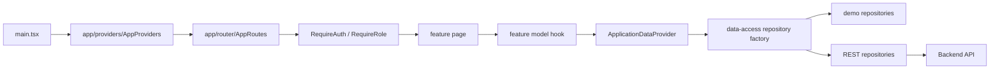

# KC Safety frontend architecture

This document applies the mandatory baseline in [`../rule.md`](../rule.md) to the current React application. The refactor preserves all existing routes, text, styling, role behavior, demo accounts, browser persistence, and rendered flows.

## Runtime flow



UI components never import demo fixtures, browser persistence, `fetch`, or REST transport code. Demo/API selection occurs once in repository composition.

## Source structure

```text
src/
  app/
    config/               # Validated runtime configuration
    layouts/              # Application shell/navigation composition
    providers/            # Startup and cross-feature provider composition
    router/               # Route manifest, links, guards, registration
  features/
    admin/
    assessment/
    auth/
    dashboard/
    notifications/
    onboarding/
    settings/
    sites/
  shared/
    domain/               # Pure cross-feature calculations
    ui/                   # Reusable UI primitives
    types.ts              # Cross-feature domain types
    utils.ts              # Product-neutral utilities
  data-access/
    contracts.ts          # Repository and domain-facing contracts
    repositories/         # Demo/API adapter selection
    rest/                 # HTTP client, token store, REST adapters
  demo/
    fixtures/             # Every seeded/demo record
    repositories/         # Demo persistence and mutations
  main.tsx
  styles.css
```

Each feature exposes a small `index.ts`. Pages import feature hooks and shared UI; they do not select adapters or construct URLs for the Backend.

## State ownership

| State | Current owner | Persistence |
|---|---|---|
| Assessment, sites, users, imports, notifications | `ApplicationDataProvider` backed by the selected repository | Demo repository namespace; REST later |
| Authentication user | Auth feature | Existing local session namespace |
| Passkey demonstration records | Auth feature | Existing local passkey namespace |
| Theme/accent | Settings feature | Existing presentation namespace |
| Guided setup | Onboarding feature | Existing guided-setup namespace |
| Navigation collapse | App shell | Existing presentation namespace |
| Route/navigation state | React Router | URL/history |

The provider keeps the established synchronous demo behavior. Live API migration must select exactly one server-state engine—TanStack Query or RTK Query—through an ADR. Two server caches are forbidden.

## Routing and authorization

- `route-manifest.ts` is the typed inventory of public, authenticated, and role-scoped routes.
- `AppRoutes.tsx` registers those paths without changing existing URLs.
- `RequireAuth` redirects anonymous users to `/login` while retaining the attempted location.
- `RequireRole` redirects a signed-in user to the home route for their assigned role.
- Frontend guards protect navigation only. The future Backend must independently enforce identity, scope, permission, and resource ownership.

## Data sources

Demo is the default and preserves the current review build.

```text
feature page -> feature hook -> ApplicationDataProvider
             -> applicationRepositoryFor(source)
             -> demoApplicationRepository OR API repository
```

Authentication follows the same boundary through `authenticationGatewayFor(source)`. No auth feature file imports `src/demo`.

To remove demo mode:

1. Implement the documented endpoints in `src/data-access/rest/repositories.ts`.
2. Replace the temporary empty API application repository with REST-backed resource loading.
3. Set `VITE_API_BASE_URL`.
4. Disable `VITE_ENABLE_DEMO_AUTH`.
5. Remove the development source selector.
6. Delete `src/demo`; the architecture check will identify any remaining imports.

## REST boundary

`RestClient` owns:

- Base URL resolution.
- Authorization-token attachment.
- JSON and multipart handling.
- Network and non-success error normalization.
- API error code and request-ID capture.

API DTO conversion belongs inside REST repositories. Components receive domain types only. The current API contract is documented in [`api-integration.md`](api-integration.md).

## Enforcement

Run:

```powershell
npm.cmd run verify
```

The architecture check rejects:

- Application code at the `src` root.
- Direct `fetch` outside the shared REST client.
- Raw environment access outside the configuration module.
- Demo imports outside demo/repository composition.
- Feature pages importing REST details.
- Retired root/screen/component compatibility imports.
- Missing feature public entrypoints.
- Duplicate route-manifest entries.

## Behavior-preservation contract

Architectural refactors must not change:

- Route URLs or redirect outcomes.
- Role visibility and navigation.
- Rendered copy or CSS class names.
- Demo credentials and seeded data.
- Local-storage keys or editable demo behavior.
- Guided setup, theme, evidence, import, notification, or passkey flows.

Any intentional product change requires a separate task and visual acceptance review.
